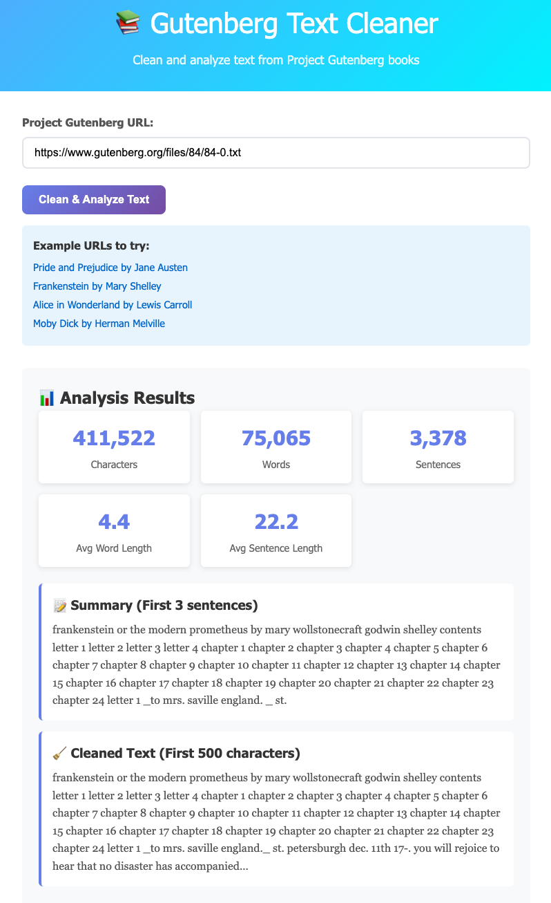

# 📚 Gutenberg Text Cleaner
### Operational Assignment 3 — Basics of AI (EAS 510) | Spring 2026

A Flask-based web service that fetches, cleans, and analyzes text from Project Gutenberg. Built as a scaffolding exercise for the Shannon language experiments assignment.

---

## 🖥️ Screenshots

### Working Application

| Alice in Wonderland | Moby Dick |
|---|---|
|  |  |

| Frankenstein | Pride and Prejudice |
|---|---|
|  |  |

### Terminal Output

| starter_preprocess.py | app.py | test_setup.py |
|---|---|---|
|  |  |  |

---

## 🚀 Setup Instructions

### 1. Fork & Open in Codespaces
```
Fork this repository → Open in GitHub Codespaces
```

### 2. Install Dependencies
```bash
pip install -r requirements.txt
```

### 3. Run the Application
```bash
python app.py
```

### 4. Open in Browser
Visit **http://localhost:5000** or use the Codespaces port forwarding popup.

---

## 📁 Project Structure

```
scaffolding3_startup/
├── app.py                  # Flask web service with API endpoints
├── starter_preprocess.py   # Text preprocessing and frequency analysis
├── requirements.txt        # Python dependencies
├── templates/
│   └── index.html          # Web interface
└── screenshots/            # Screenshots of working application
```

---

## 🔌 API Endpoints

| Method | Endpoint | Description |
|---|---|---|
| `GET` | `/` | Web interface |
| `GET` | `/health` | Health check |
| `POST` | `/api/clean` | Fetch and clean text from a Gutenberg URL |
| `POST` | `/api/analyze` | Analyze statistics from raw text |

### Example Request — `/api/clean`
```json
POST /api/clean
{
    "url": "https://www.gutenberg.org/files/1342/1342-0.txt"
}
```

### Example Response
```json
{
    "success": true,
    "cleaned_text": "...",
    "statistics": {
        "total_characters": 702482,
        "total_words": 127518,
        "total_sentences": 7356,
        "avg_word_length": 4.5,
        "avg_sentence_length": 17.4,
        "most_common_words": [["the", 4507], ["to", 4243], ...]
    },
    "summary": "First 3 sentences of the book..."
}
```

---

## 📖 Test URLs

| Book | URL |
|---|---|
| Pride and Prejudice | https://www.gutenberg.org/files/1342/1342-0.txt |
| Frankenstein | https://www.gutenberg.org/files/84/84-0.txt |
| Alice in Wonderland | https://www.gutenberg.org/files/11/11-0.txt |
| Moby Dick | https://www.gutenberg.org/files/2701/2701-0.txt |

---

## 🛠️ Dependencies

| Package | Purpose |
|---|---|
| `flask` | Web framework and API routing |
| `requests` | Fetching text from Gutenberg URLs |
| `Werkzeug` | Flask's underlying request/response toolkit |
| `Jinja2` | HTML templating engine used by Flask |
| `beautifulsoup4` | HTML parsing utilities |
| `nltk` | Natural language processing toolkit |
| `python-dotenv` | Environment variable management |

---
